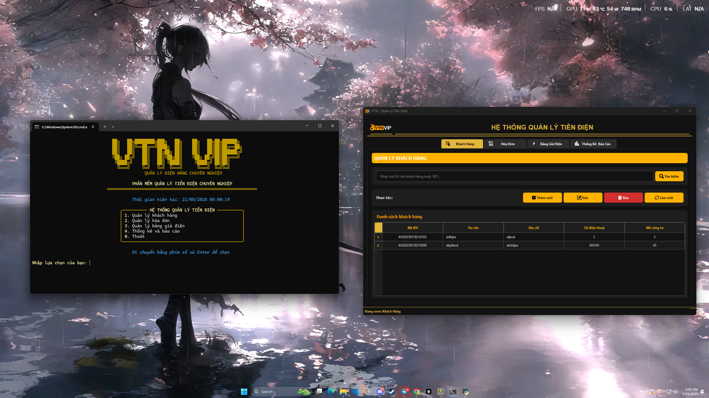

# 🔌 Ứng Dụng Quản Lý Tiền Điện VTN - VIP


Ứng dụng quản lý tiền điện toàn diện cho doanh nghiệp điện lực, hỗ trợ đầy đủ các tính năng từ quản lý khách hàng đến tính toán hóa đơn và xuất báo cáo.

## ✨ Tính năng nổi bật

- 👥 **Quản lý khách hàng**: Thêm, sửa, xóa và tìm kiếm thông tin khách hàng
- 📝 **Quản lý hóa đơn**: Tạo và quản lý hóa đơn theo tháng
- 🧮 **Tính toán thông minh**: Tự động tính tiền theo bậc thang giá điện Việt Nam
- 📊 **Báo cáo thống kê**: Xuất báo cáo doanh thu, tiêu thụ điện theo khu vực, thời gian
- 🖨️ **Xuất hóa đơn PDF**: Tạo hóa đơn chuyên nghiệp với đầy đủ thông tin
- 💾 **Xuất dữ liệu JSON**: Dễ dàng tích hợp với các hệ thống khác
- 🌙 **Giao diện hiện đại**: Hỗ trợ giao diện tối/sáng, thân thiện với người dùng

## 📷 Hình ảnh demo



## 🚀 Cài đặt

### Yêu cầu hệ thống

- Python 3.8 trở lên
- Các thư viện được liệt kê trong requirements.txt

### Cài đặt thư viện

```bash
# Tạo môi trường ảo (khuyến nghị)
python -m venv .venv
source .venv/bin/activate  # Linux/macOS
# hoặc
.venv\Scripts\activate  # Windows

# Cài đặt thư viện
pip install -r requirements.txt
```

## 🎮 Sử dụng

### Phiên bản dòng lệnh (CMD)

```bash
python cmd_app/main.py
```

### Phiên bản giao diện đồ họa (Desktop)

```bash
python desktop_app/main.py
```

## 📋 Cấu trúc dự án

```
├── cmd_app/            # Phiên bản dòng lệnh
├── desktop_app/        # Phiên bản giao diện đồ họa
│   ├── gui/            # Các thành phần giao diện
│   ├── main.py         # Điểm khởi đầu ứng dụng
├── data/               # Nơi lưu trữ dữ liệu
├── models/             # Các mô hình dữ liệu
├── imgs/               # Hình ảnh sử dụng trong ứng dụng
├── font/               # Font chữ
├── requirements.txt    # Danh sách thư viện cần thiết
```

## 📝 Mẫu hóa đơn

Ứng dụng hỗ trợ xuất hóa đơn chuyên nghiệp với:
- Thông tin đơn vị điện lực và khách hàng
- Chi tiết chỉ số đầu - cuối và lượng điện tiêu thụ
- Tính tiền theo bậc thang giá điện hiện hành
- Tổng tiền, thuế VAT và thanh toán
- Mã QR để thanh toán trực tuyến
- Hỗ trợ tiếng Việt đầy đủ

## 🌡️ Biểu giá điện

Ứng dụng áp dụng biểu giá điện theo quy định mới nhất của Bộ Công Thương:

| Bậc | Mức sử dụng (kWh) | Đơn giá (VNĐ/kWh) |
|-----|-------------------|-------------------|
| 1   | 0 - 50            | 1,984             |
| 2   | 51 - 100          | 2,050             |
| 3   | 101 - 200         | 2,380             |
| 4   | 201 - 300         | 2,998             |
| 5   | 301 - 400         | 2,335             |
| 6   | 401 trở lên       | 2,346             |


## 🔧 Phát triển

Hướng dẫn dành cho nhà phát triển:

```bash
# Clone dự án
git clone https://github.com/your-username/vtn-quan-ly-dien.git
cd vtn-quan-ly-dien

# Cài đặt môi trường phát triển
python -m venv .venv
source .venv/bin/activate  # Linux/macOS
# hoặc
.venv\Scripts\activate  # Windows

pip install -r requirements.txt

# Chạy ứng dụng
python desktop_app/main.py
```

## 🤝 Đóng góp

Chúng tôi luôn hoan nghênh mọi đóng góp để cải thiện ứng dụng. Vui lòng tạo Pull Requests hoặc báo cáo lỗi qua Issues.

## 📄 Giấy phép

Dự án được phân phối dưới Giấy phép MIT. Xem file `LICENSE` để biết thêm thông tin.

## 🙏 Liên hệ

Nếu có bất kỳ câu hỏi hoặc góp ý nào, vui lòng liên hệ:
- Email: [email@vtn-dien.com](mailto:email@vtn-dien.com)
- Website: [www.vtn-dien.com](https://www.vtn-dien.com) 
